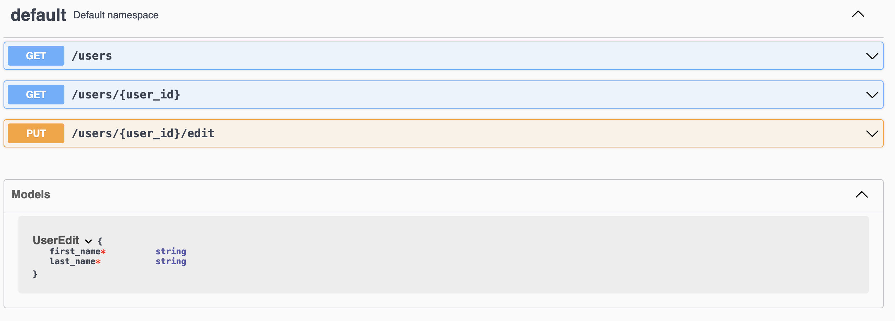

# Flask Authentication



Flask-based RESTful API for managing users.

## Features

- **Login**: Allows users to authenticate and access protected resources.
- **Register**: Token-based authentication with email verification for new user registration.
- **Reset Password**: Password reset functionality via email for user accounts.
- **Change Password**: Ability for users to change their password, authenticated via email.

## Installation

1. Clone the repository:

   ```bash
   git clone https://github.com/AppleBoiy/Flask-Auth.git
   ```

2. Navigate into the project directory:

   ```bash
   cd Flask-Auth
   ```

3. Build and run your Docker containers:

   ```bash
   make build
   ```

   The application should now be accessible at [http://localhost:56733](http://localhost:56733).

## Usage

### Sample Requests

You can use Postman to interact with the API. For detailed examples and to explore the API endpoints, please refer.

[](https://app.getpostman.com/run-collection/27963483-a2ef16ea-7f10-45bb-9f98-a9d658532a51?action=collection%2Ffork&source=rip_markdown&collection-url=entityId%3D27963483-a2ef16ea-7f10-45bb-9f98-a9d658532a51%26entityType%3Dcollection%26workspaceId%3D71a69b4d-4cfd-4e21-bba4-76c30dafb56c)

## License

This project is licensed under the [MIT License](LICENSE).